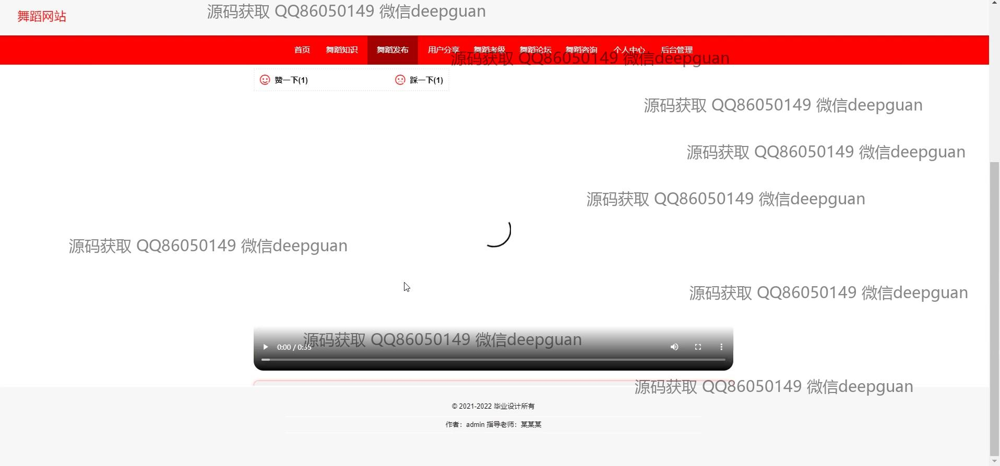
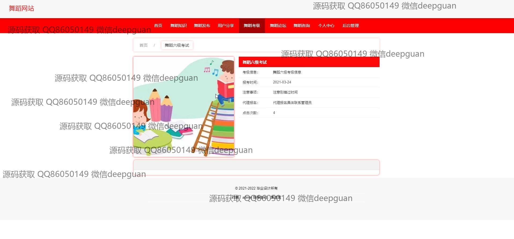

<h1 align="center">基于MVC的舞蹈网站的设计与实现+vue</h1>

## 简介
舞蹈网站：角色分为管理员、用户；功能包括用户管理、舞蹈知识管理、舞蹈发布、舞蹈考级管理、舞蹈论坛、资讯发布与管理、视频上传与分享。    --计算机毕业设计源码；毕设源码；java毕业设计源码

## 联系方式

<h3 align="center">获取完整代码与数据库文件 + 微信：deepguan QQ: 86050149 QQ群: 783742310</h3>

<h3 align="center">可帮忙远程部署 包运行成功！提供远程部署、修改代码、设计文档指导、代码讲解等服务！</h3>

## 功能介绍（完整见运行截图）
管理员：基本功能包括管理登录和退出，用户管理，舞蹈课程和考试管理，舞蹈知识和资讯发布，论坛帖子管理，以及系统管理。可通过后台界面进行导航栏维护，设置舞蹈考级信息，上传和发布舞蹈视频和资讯，管理用户收藏以及轮播图，审核用户分享内容。

用户：基本功能包括用户注册、登录、退出。用户可以在网站首页通过导航栏访问舞蹈知识、舞蹈课程、舞蹈视频和资讯发布等内容。支持搜索舞蹈知识、查看舞蹈课程和资讯详情，评论和分享舞蹈视频，参与论坛交流。用户中心提供个人信息编辑、查看我的发布和收藏管理功能。

## 运行截图

本代码来源于网络,仅供学习参考使用!

